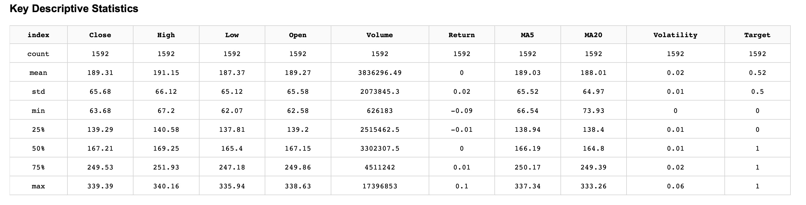
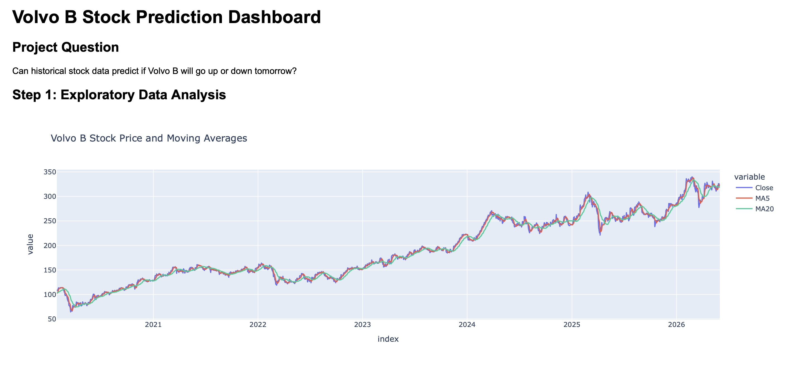
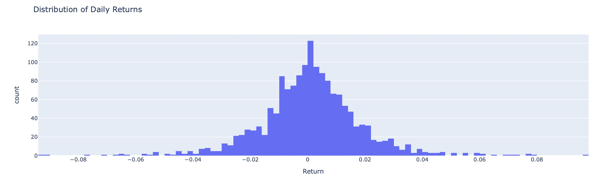
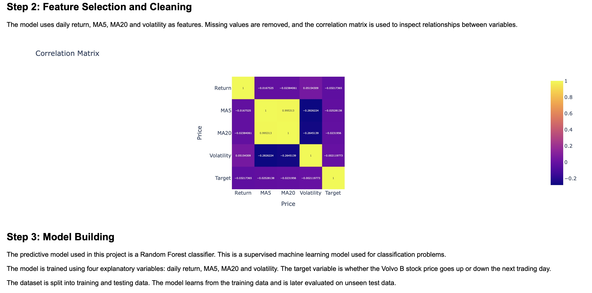
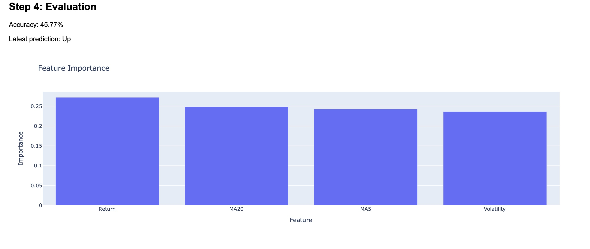
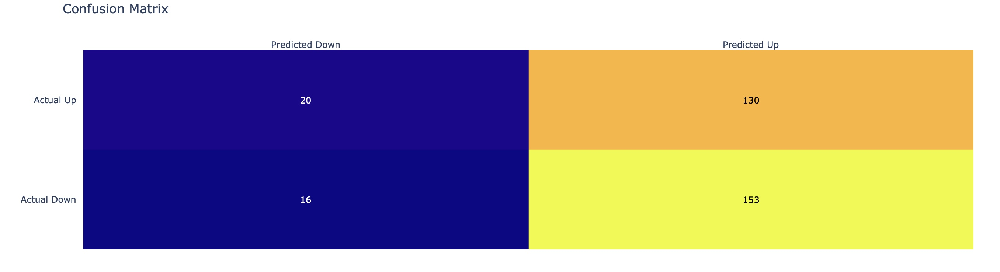

# Volvo B Stock Prediction Dashboard

## Overview
This project analyzes historical stock market data for Volvo B (VOLV-B.ST) and investigates whether past market information can be used to predict the direction of the stock price on the following trading day.

Using data retrieved from Yahoo Finance, a machine learning model is trained to classify whether the closing price will increase or decrease the next trading day. The results are presented through an interactive Dash dashboard containing exploratory analysis, model performance metrics, and feature importance visualizations.


## Research Question
Can historical Volvo B stock data be used to predict whether the stock price will increase or decrease on the next trading day?


## Dataset
The dataset is collected using the yfinance Python package and contains daily historical stock market data for Volvo B (VOLV-B.ST) from January 2020 onwards.

Variables include:

* Open price
* High price
* Low price
* Close price
* Trading volume

Additional features were engineered from the raw data, including:

* Daily returns
* Moving averages
* Target variable indicating whether the next day’s closing price increased or decreased


## Methodology
### Exploratory Data Analysis (EDA)
The dataset was explored using descriptive statistics and visualizations to understand:

* Price trends over time
* Return distributions
* Relationships between variables
* Correlations among features

### Data Cleaning and Feature Engineering
The dataset was prepared by:

* Handling missing values
* Creating moving average indicators
* Calculating daily returns
* Constructing a binary target variable for next-day stock direction

### Model Development
A Random Forest Classifier was used to predict whether the Volvo B stock price would increase or decrease on the next trading day.

Random Forest is an ensemble learning method that consists of many individual decision trees. Each tree is trained on a slightly different subset of the historical stock data and makes its own prediction based on features such as price movements, trading volume, daily returns, and moving averages.

Within each tree, the data is split through a series of decision rules. For example, a tree may ask questions such as: Is the daily return positive?, is the current price above the 20-day moving average?, or is trading volume higher than usual? Based on the answers, the observation moves through the tree until a prediction is reached.

The final prediction is determined through majority voting across all trees in the forest. If most trees predict that the stock price will increase, the model classifies the next trading day as an upward movement, and vice versa.

This approach reduces the risk of overfitting to individual patterns in the training data and allows the model to capture complex, non-linear relationships that are common in financial markets.

### Evaluation
Model performance was evaluated using:

* Accuracy score
* Confusion matrix
* Feature importance analysis

These metrics provide insight into how effectively the model predicts future stock direction.


## Dashboard Features
The interactive Dash dashboard includes:

* Summary statistics
* Historical stock price visualization
* Daily return distribution
* Correlation matrix
* Feature importance ranking
* Confusion matrix
* Prediction accuracy metrics


## Project Structure
data.py
model.py
dashboard.py
requirements.txt
README.md
images

### File Description
data.py - Data collection and feature engineering

model.py - Model training and evaluation

dashboard.py - Interactive Dash dashboard


## Installation

### Clone the repository
```bash
git clone https://github.com/dannejsodra-droid/Final-Project.git
cd Final-Project
```

### Create a Virtual Environment
```bash
python -m venv .venv
source .venv/bin/activate
```

### Install Dependencies
```bash
pip install -r requirements.txt
```


## Running the Dashboard

### Start the Application
```bash
python dashboard.py
```
Then open:
```text
http://127.0.0.1:8050/
```
in your browser.

Screenshots from dashboard

## Dashboard Preview

### Key Descriptive Statistics



### Stock Price Development



### Daily Returns Distribution



### Correlation Matrix



### Feature Importance



### Confusion Matrix




## Technologies Used
* Python
* Pandas
* NumPy
* Plotly
* Dash
* Scikit-learn
* yfinance


## Authors
Daniel Ahlm and Pelle Jerkeman

Advanced Python Workshops - Final Project